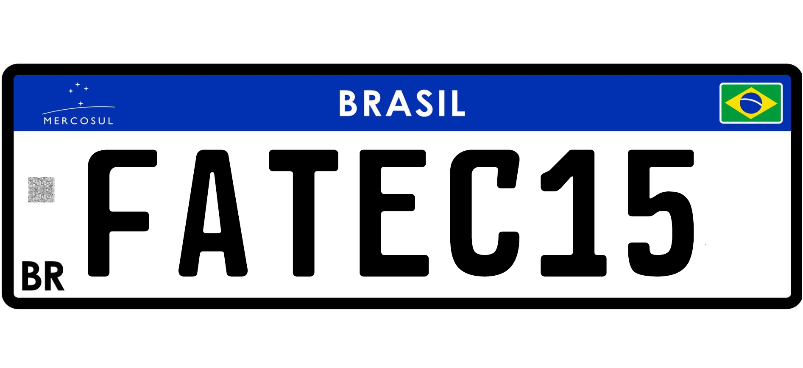

<h1 align="center">
  Reconhecimento de Caracteres de Novas Placas do Mercosul utilizando Inteligência Artificial e Internet das Coisas
</h1>
<h4 align="center">
    
</h4>

<p align="center">
  

  
  
  <a href="https://github.com/apsampaio/artigo/commits/master">
    
  </a>
</p>

## 🚘 Projeto

Com a chegada do novo modelo de placas do Mercosul, a criação de um sistema embarcado para a análise das informações contidas na placa seria muito relevante para o estudo de conexões pertinentes entre computadores robustos e microcontroladores.

## 🚀 Tecnologias

Este projeto foi desenvolvido utilizando as seguintes tecnologias:

- [📗 Node.js](https://nodejs.org/en/)
- [📘 TypeScript](https://www.typescriptlang.org/)
- [🤖 Tesseract.js](https://github.com/naptha/tesseract.js)
- [📧 Express](https://github.com/expressjs/express)
- [💾 Multer](https://github.com/expressjs/multer)
- [🚗 sinesp-api](https://github.com/Sorackb/sinesp-api)
- [🟣 Insomnia](https://insomnia.rest/download/)
- [♾ Arduino IDE](https://www.arduino.cc/en/main/software)
- [🕹 ESP32-CAM](https://www.espressif.com/en/news/ESP32_CAM)

## 👩‍💻 Reproduzindo o Projeto

#### Clonando o projeto

```sh
git clone https://github.com/apsampaio/artigo.git
cd artigo
cd Server
npm install
```

#### Iniciando o Servidor

```sh
cd Server
npm start
```

#### Adicionando ESP32 no Arduino IDE

> [📄 Arduino core for the ESP32](https://github.com/espressif/arduino-esp32)

#### Configuração Client.ino

Configurar as seguintes variáveis com suas informações antes da gravação:

```c
#define IP "YOUR_LOCAL_IP"
char* ssid = "YOUR_SSID";
char* password = "YOUR_PASSWORD";
```

#### Pinagem ESP32-CAM Para Gravação

| ESP32 | Componentes |
| ----- | ----------- |
| unR   | FTDI TX     |
| UOT   | FTDI RX     |
| GND   | FTDI GND    |
| IO0   | GND         |
| 5V    | Fonte 5V    |
| GND   | Fonte GND   |

#### Pinagem ESP32-CAM Para Utilização

| ESP32 | Componentes   |
| ----- | ------------- |
| unR   | FTDI TX       |
| UOT   | FTDI RX       |
| GND   | FTDI GND      |
| IO2   | PULLUP BUTTON |
| 5V    | Fonte 5V      |
| GND   | Fonte GND     |

## 👣 Rotas do Servidor

#### POST

##### ESTRUTURA

```http
POST /placa HTTP/1.1
Content-Type: multipart/form-data; boundary=---011000010111000001101001
Host: localhost:3333
Content-Length: 114

-----011000010111000001101001
Content-Disposition: form-data; name="placa"


-----011000010111000001101001--
```

##### RESPOSTA ESPERADA

```json
{
  "message": "Recognition Without Filter",
  "status": "Success",
  "imageName": "74983151b499.jpeg",
  "tessdata": "eng+nummer",
  "output": "FATEC15\n"
}
```

#### GET

##### ESTRUTURA

```http
GET /placa?placa=PLACA HTTP/1.1
Host: localhost:3333
```

##### RESPOSTA ESPERADA

```json
{
  "ano": "2007",
  "anoModelo": "2008",
  "chassi": "*********",
  "codigoRetorno": "0",
  "codigoSituacao": "0",
  "cor": "Prata",
  "data": "29/02/2020 às 21:09:34",
  "dataAtualizacaoAlarme": "",
  "dataAtualizacaoCaracteristicasVeiculo": "",
  "dataAtualizacaoRouboFurto": "",
  "marca": "GM/CELTA",
  "mensagemRetorno": "Sem erros.",
  "modelo": "GM/CELTA",
  "municipio": "SOROCABA",
  "placa": "PLACA",
  "situacao": "Sem restrição",
  "uf": "SP"
}
```

## 📷 Capturas

> [🎴 Capturas com ESP32](https://github.com/apsampaio/artigo/tree/master/capturas)

## 🖼 Representação Digital Placa Mercosul

<h4 align="center">
    
</h4>

Made with ❤ by Andre Sampaio 👋
